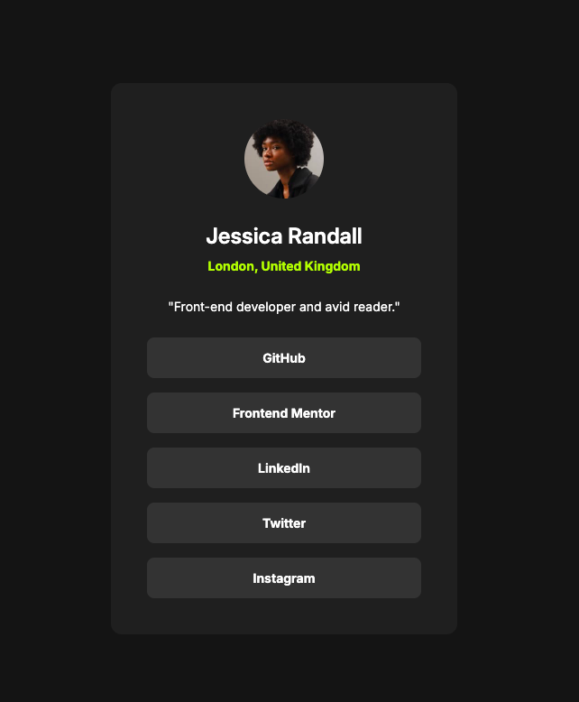

# Frontend Mentor - Social links profile solution by Angelica Parada

This is a solution to the [Social links profile challenge on Frontend Mentor](https://www.frontendmentor.io/challenges/social-links-profile-UG32l9m6dQ). Frontend Mentor challenges help you improve your coding skills by building realistic projects. 

## Table of contents

- [Overview](#overview)
  - [The challenge](#the-challenge)
  - [Screenshot](#screenshot)
  - [Links](#links)
- [My process](#my-process)
  - [Built with](#built-with)
  - [What I learned](#what-i-learned)
  - [Useful resources](#useful-resources)
- [Author](#author)


## Overview

### The challenge

Users should be able to:

- See hover and focus states for all interactive elements on the page

### Screenshot



### Links

- Solution URL: [https://github.com/angie-create/social-links-profile]
- Live Site URL: [https://angie-create.github.io/social-links-profile/]

## My process

### Built with

- Semantic HTML5 markup
- CSS custom properties
- Flexbox

### What I learned

```html

 <link rel="preconnect" href="https://fonts.googleapis.com">
  <link rel="preconnect" href="https://fonts.gstatic.com" crossorigin>
  <link href="https://fonts.googleapis.com/css2?family=Inter:ital,opsz,wght@0,14..32,100..900;1,14..32,100..900&display=swap" rel="stylesheet">

```
- I added Google fonts and used semantic HTML5

```css

button:hover {
    background: var(--color-green, #C4F82A);
    color: var(--color-grey-700, #333);
}

@media only screen and (max-width: 375px) {
    .card {
        display: flex;
        padding: var(--spacing-300, 24px);
        flex-direction: column;
        align-items: center;
        gap: var(--spacing-300, 24px);
        flex: 1 0 0;
    }
}

```
- I used query to make it responsive and hover

### Useful resources

- [Resource 1](https://developer.mozilla.org/en-US/docs/Web/HTML/Element) - This helped me to use semantic HTML5 correctly.


## Author

- LinkedIn - [Angelica Parada](https://www.linkedin.com/in/angelica-parada/)
- Frontend Mentor - [@angie-create](https://www.frontendmentor.io/profile/angie-create)

